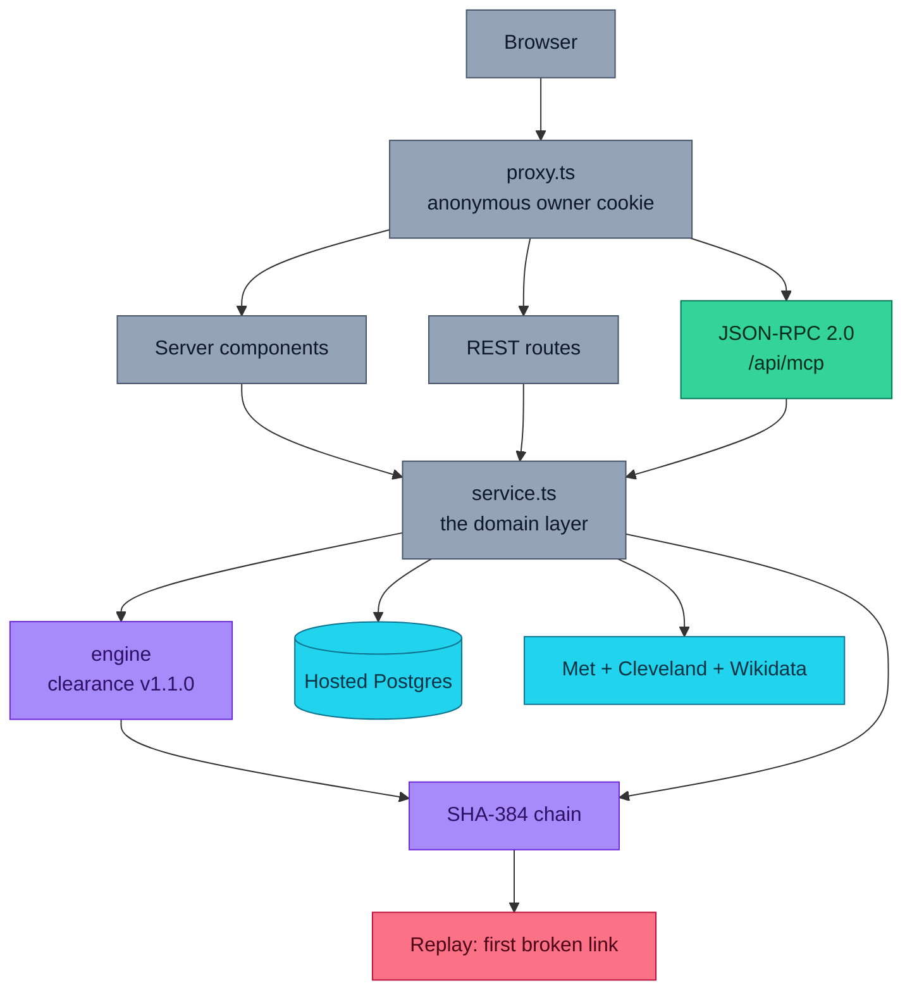
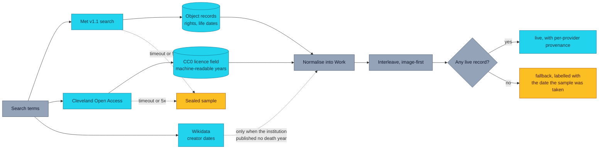
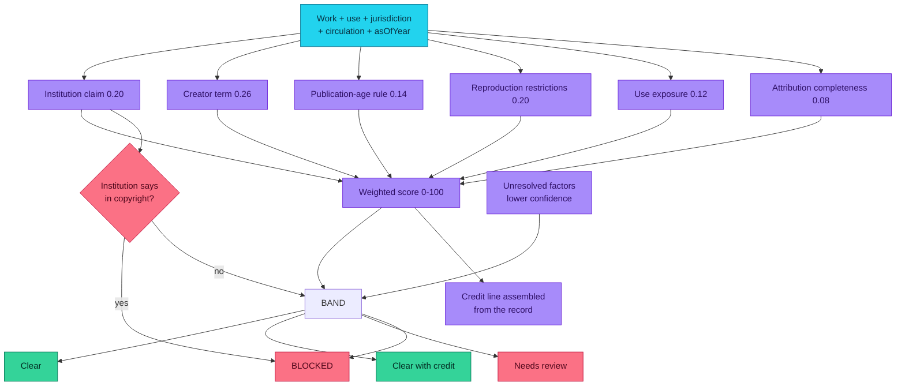
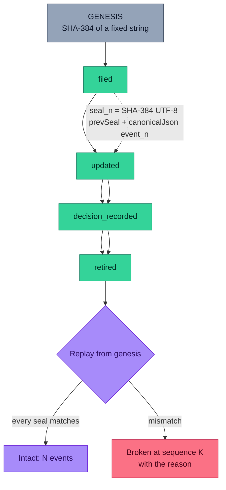
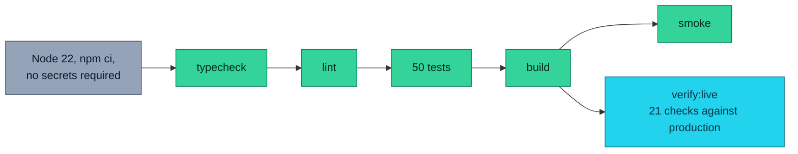
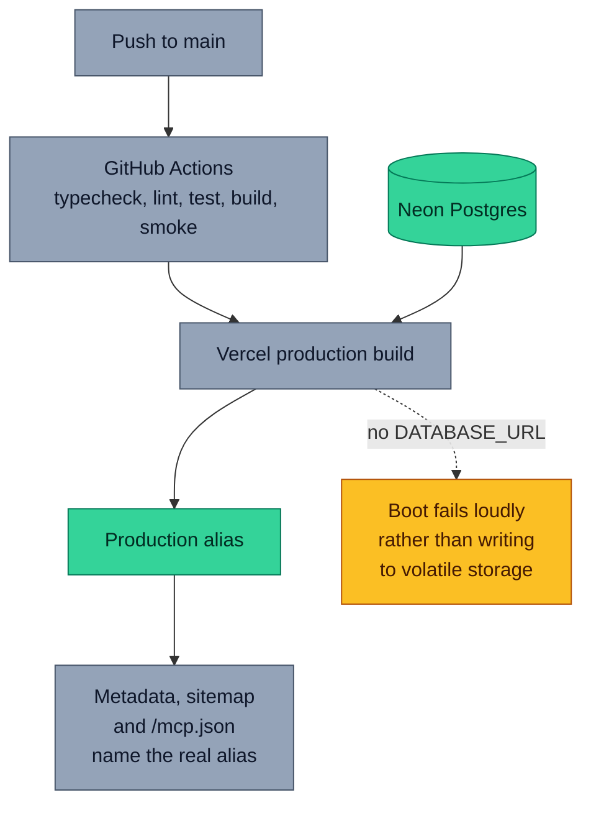
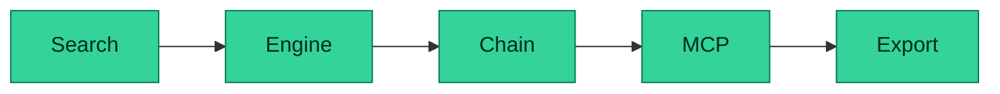
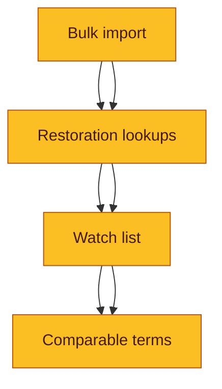
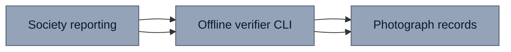

<div align="center">

# OpenPlate

### Know what you are allowed to put in print.

[](https://openplate.vercel.app)
[](LICENSE)
[](https://nextjs.org)
[](tsconfig.json)
[](src/lib/db)
[](src/lib/sources)
[](https://openplate.vercel.app/agent)
[](tests)
[](.github/workflows/ci.yml)

[Live app](https://openplate.vercel.app) · [GitHub](https://github.com/aniruddhaadak80/openplate) · [Health](https://openplate.vercel.app/api/health) · [Agent](https://openplate.vercel.app/agent) · [Issues](https://github.com/aniruddhaadak80/openplate/issues)

</div>

---

A painting can be out of copyright and the photograph of it can still be protected.

That sentence is the whole problem, and almost every tool gets it wrong in the
same direction. Museums publish **two different things** about one artwork:

| | What the institution publishes | Example, from a real record |
| --- | --- | --- |
| **The artwork** | whether the work is in copyright | Monet, 1867, creator died 1926 → life + 70 expired in **1997** |
| **The reproduction** | whether *their picture of it* is in copyright | The Met's record for it is flagged **in copyright** |

Neither answer is wrong. They are different rights, and only the first one is
usually what the person using the image checked. OpenPlate reads both, does the
arithmetic on the published term, and shows the sentence behind every point of
the score.

It exists because the job is real and annoying. Somebody has to put a picture in a
newsletter, a deck, a print run or a game, has to be able to say *why* they are
allowed to, and has to hand a colleague something checkable instead of a guess.

## ✨ Features

- **Live search across two open-access collections.** The Metropolitan Museum of
  Art and The Cleveland Museum of Art, no API key, with the institution's own
  rights claim on every record.
- **The artwork/reproduction distinction, made explicit.** Term arithmetic and
  reproduction restrictions are reported separately, because averaging them
  produces a number that means nothing.
- **A versioned, explainable engine.** Six weighted factors, each with its raw
  value, its points and a sentence you could check. Identical arithmetic in the
  browser, the REST API and the agent tools.
- **Restriction text parsed out of the real statement.** The Met's Picasso records
  read *"Ac 2026 Estate of Pablo Picasso / Artists Rights Society (ARS), New York"*.
  OpenPlate finds that estate, that collecting society and that holder, and
  reports the offsets so the interface can underline the exact words.
- **A step wedge you drag** to watch the verdict move as the intended use escalates
  from personal to broadcast — a real hypothetical, not an animation.
- **A SHA-384 hash chain per plate,** replayable from a fixed genesis value, with
  a known vector in the tests and a public verify endpoint.
- **Six MCP tools over JSON-RPC 2.0,** including two mutations that go through the
  same service layer the buttons use.
- **A downloadable docket** in Markdown, CSV and JSON, carrying the credit line,
  the arithmetic, the restrictions, the decision and the seals.
- **Honest about failure.** If an institution is unreachable the sealed sample
  stands in and says so, with the date it was taken. If a verdict is computed from
  a field nobody published, confidence drops and the band becomes *Needs review*.

## 🚀 Quickstart

```bash
git clone https://github.com/aniruddhaadak80/openplate.git
cd openplate
npm install
npm run dev
```

Open <http://localhost:3000>. **No environment variables and no API key are
required.** Without `DATABASE_URL` the app runs on an embedded PGlite build of
Postgres in `./.pglite`, so the schema, constraints, indexes and transactions you
exercise locally are the ones that run in production. All three upstream
institutions are keyless public endpoints.

### Scripts

| Command | What it does |
| --- | --- |
| `npm run dev` | Development server |
| `npm run typecheck` | `tsc --noEmit` |
| `npm run lint` | ESLint |
| `npm run test` | Vitest: engine, hash chain, full CRUD over a real database |
| `npm run build` | Production bundle |
| `npm run smoke` | Playwright: the primary journey through visible controls |
| `npm run verify:local` | Boots the production bundle and runs the full live verifier against it |
| `npm run verify:live` | Runs the same verifier against a deployment (`BASE_URL=...`) |

### Production variables

Only one is required, and it is documented without a value in [`.env.example`](.env.example).

| Variable | Required | Purpose |
| --- | --- | --- |
| `DATABASE_URL` | **Yes, in production** | Hosted Postgres. Neon via the Vercel Marketplace supplies it automatically. Without it a production build **refuses to open the repository** rather than writing into volatile storage. |
| `DATABASE_SCHEMA` | No | Schema namespace, to share one database. Defaults to `public`. |
| `NEXT_PUBLIC_SITE_URL` | No | Canonical origin for metadata, the sitemap and the MCP manifest. Defaults to the alias Vercel injects. |
| `OPENPLATE_OFFLINE` | No | Force the sealed sample with no network. Used by tests. |

OpenPlate deliberately has no third-party API keys: the Met, Cleveland and
Wikidata endpoints require none, and adding one would make the demo depend on
something a visitor does not have.

## 🔌 API

Typed REST over the same service layer as the interface and the agent tools.
Errors always arrive as `{"error":{"code","message","fields"?}}`.

```bash
# 1. Search both collections, live.
curl -s 'https://openplate.vercel.app/api/works?q=jaguar&limit=4' | jq '.works[] | {id, title, institutionCleared}'

# 2. Pin a real record to an intended use. Returns 201 with the plate and its seal.
curl -s -X POST https://openplate.vercel.app/api/plates \
  -H 'content-type: application/json' \
  -b cookies.txt -c cookies.txt \
  -d '{"workId":"met:11298","use":"editorial","jurisdiction":"us","circulation":10000,"note":"Issue 14"}' \
  | jq '{id: .plate.id, shareUrl, band: .assessment.band, score: .assessment.score, seal: .plate.seal}'

# 3. Read it back through the UI-facing API.
curl -s -b cookies.txt https://openplate.vercel.app/api/plates | jq '.plates[0] | {title, use, chain}'

# 4. Change the inputs. The verdict is recomputed and the change is sealed.
curl -s -X PATCH https://openplate.vercel.app/api/plates/<PLATE_ID> \
  -H 'content-type: application/json' -b cookies.txt \
  -d '{"use":"merchandise","circulation":250000}' | jq '.assessment.band'

# 5. Run the engine for a hypothetical, saving nothing.
curl -s -X POST https://openplate.vercel.app/api/plates/<PLATE_ID>/assess \
  -H 'content-type: application/json' -b cookies.txt \
  -d '{"use":"broadcast"}' | jq '{band: .assessed.band, differs: .differsFromSaved}'

# 6. Record a sealed decision.
curl -s -X POST https://openplate.vercel.app/api/plates/<PLATE_ID>/decision \
  -H 'content-type: application/json' -b cookies.txt \
  -d '{"decision":"approved","note":"Term satisfied, credit line complete."}' | jq '.seal'

# 7. Replay the chain.
curl -s -b cookies.txt https://openplate.vercel.app/api/plates/<PLATE_ID>/verify \
  | jq '.verification | {ok, eventCount, brokenAtSeq}'

# 8. Download the docket.
curl -s 'https://openplate.vercel.app/api/docket/<SHARE_CODE>?format=md'

# 9. Retire it. It is a tombstone: gone from reads, retained for verification.
curl -s -X DELETE -b cookies.txt https://openplate.vercel.app/api/plates/<PLATE_ID> | jq '{retired, note}'
```

| Route | Methods | Purpose |
| --- | --- | --- |
| `/api/health` | `GET` | Real probe of the configured store. Reports `ok` and `durable` separately. |
| `/api/works` | `GET` | Live search, per-provider provenance, honest `degraded` flag. |
| `/api/plates` | `GET` `POST` | The docket, and filing a plate. `POST` is idempotent on `idempotencyKey`. |
| `/api/plates/<id>` | `GET` `PATCH` `DELETE` | Read, change inputs, retire as a tombstone. |
| `/api/plates/<id>/assess` | `GET` `POST` | Committed verdict, or a hypothetical that saves nothing. |
| `/api/plates/<id>/decision` | `POST` | Record a decision, sealed with the verdict that was read. |
| `/api/plates/<id>/verify` | `GET` | Replay the chain, first broken link reported. |
| `/api/docket/<shareCode>` | `GET` | Download as `?format=json\|csv\|md`. |
| `/api/terms` | `GET` `PUT` | Persisted defaults and the seeded term rules. |
| `/api/mcp` | `POST` `GET` | JSON-RPC 2.0: `initialize`, `tools/list`, `tools/call`, `ping`. |
| `/mcp.json` | `GET` | Manifest with the live endpoint already filled in. |

## 🤖 Agent tools

The MCP endpoint is at **`https://openplate.vercel.app/api/mcp`**, and
[`/mcp.json`](https://openplate.vercel.app/mcp.json) is generated at request time
with that host already filled in.

```json
{
  "mcpServers": {
    "openplate": {
      "type": "http",
      "url": "https://openplate.vercel.app/api/mcp",
      "transport": "streamable-http"
    }
  }
}
```

| Tool | Kind | What it does |
| --- | --- | --- |
| `search_works` | read | Both collections, normalised, with each institution's rights claim. |
| `assess_work` | analysis | The engine on a record, saving nothing. |
| `file_plate` | **mutating** | Re-reads the work live, stores a snapshot, seals the genesis event. Idempotent on `idempotencyKey`. |
| `record_decision` | **mutating** | Writes the decision with the band, score and seal of the verdict read. |
| `verify_plate` | read | Replays the chain, reports the first broken link. |
| `retire_plate` | **mutating** | Retires a plate, retaining the tombstone and its chain. |

```bash
curl -s https://openplate.vercel.app/api/mcp -H 'content-type: application/json' -d '{
  "jsonrpc":"2.0","id":1,"method":"tools/call",
  "params":{"name":"assess_work","arguments":{
    "workId":"met:19275","use":"merchandise","jurisdiction":"us","circulation":50000}}}'
```

## 📁 Project map

### User routes

| Route | User goal | States |
| --- | --- | --- |
| `/` | Search both collections and pin a work | Live/degraded banner, per-provider latency, empty state, pin form per card |
| `/plates` | The workspace: every plate, filtered | Empty state, filters and paging in the URL, retired tombstones |
| `/plates/<id>` | Inspect, re-run the engine, decide, retire | Full factor table, hypothetical vs committed, blockers, cautions, chain, retired banner |
| `/d/<shareCode>` | The read-only docket you send someone | `404` for an unknown code, renders a retired docket so it stays checkable |
| `/terms` | Jurisdiction, term rules and persisted defaults | Seeded rules read from the database, save/unsaved states |
| `/agent` | Drive the MCP tools and watch the wire | Preset calls, raw request and response, tool error states, link to whatever it wrote |
| `/export` | The downloadable artifact | Empty state, index with per-plate downloads in three formats |

### API routes

`/api/health`, `/api/works`, `/api/plates`, `/api/plates/<id>`,
`/api/plates/<id>/assess`, `/api/plates/<id>/decision`, `/api/plates/<id>/verify`,
`/api/docket/<shareCode>`, `/api/terms`, `/api/mcp`, `/mcp.json`.

### Library

| Path | Responsibility |
| --- | --- |
| `src/lib/engine/clearance.ts` | The engine. Pure, versioned, no I/O. |
| `src/lib/integrity/chain.ts` | Canonical JSON, seals, replay. |
| `src/lib/service.ts` | The domain layer every entry point calls. |
| `src/lib/sources/` | Met, Cleveland and Wikidata adapters, plus the sealed sample. |
| `src/lib/db/` | Repository interface, schema, and the Postgres and PGlite adapters. |
| `src/lib/terms.ts` | Published term lengths, use bands, circulation bands, disclaimer. |
| `src/lib/export.ts` | Docket rendering: one view, three formats. |
| `src/lib/validation.ts` | Every bounded input. |
| `src/lib/rate-limit.ts` | Best-effort anonymous abuse control. |

## 🏗 Architecture



Six routes and two entry points, one service layer, one engine, one SQL
implementation behind two adapters. The mutating agent tools and the buttons call
the *same* functions, which is why an agent and a person produce identical rows.

## 📊 Data pipeline and the honest fallback



Three things this pipeline will not do: present a fallback sample as current, hide
a provider that failed, or replace a plate you created with upstream data. User
records are never touched by a refresh.

> **Endpoint note.** `/public/collection/v1/search` was **retired on 2026-10-01**.
> OpenPlate uses `/public/collection/v1.1/search`, which is paginated, and reads
> each record from `/public/collection/v1/objects/{id}`. The search endpoint
> returns identifiers only — every rights field is in the per-record response, so
> the detail pass is unavoidable rather than decorative.

## ⚖️ The deterministic engine

Six factors, weights summing to exactly 1. The score is
`Σ (weight × normalised) × 100`; the band comes from the score, from the
institution's own claim, and from the confidence.



Three decisions worth arguing with, deliberately:

1. **The institution's negative claim is never averaged away.** If a museum
   publishes a record as in copyright, the answer is `blocked`, whatever the term
   arithmetic says. The other five factors exist to explain *how close* it got.
2. **An unresolved factor costs confidence, and low confidence is never a
   clearance.** A verdict computed from a field nobody published is not a verdict.
3. **The artwork's term and the reproduction's rights are separate factors**, so a
   record can be `satisfied` on one and `failing` on the other without being
   averaged into nonsense.

Term lengths come from `TERM_RULES` and are seeded into the database, so the
`/terms` page and the arithmetic cannot drift apart.

## 🔗 Integrity and replay



`canonicalJson` sorts object keys recursively and drops `undefined`, so two
identical events always produce an identical digest regardless of the order the
fields were written in. Arrays keep their order, because in a payload an array is
meaningful rather than incidental. `tests/chain.test.ts` pins the algorithm with a
vector recomputed using raw `node:crypto`, so a refactor cannot quietly invalidate
seals already written to somebody's database.

Retiring a plate appends a `retired` event and tombstones the row, so a docket that
was already shared keeps verifying while the record leaves the docket list.

## 🔁 The user journey

```mermaid
flowchart LR
  classDef live fill:#22d3ee,stroke:#0e7490,color:#083344
  classDef agent fill:#34d399,stroke:#047857,color:#022c22
  classDef infra fill:#94a3b8,stroke:#475569,color:#0f172a

  S[Search two collections]:::live --> P[Pin a work to an intended use]:::live
  P --> I[Inspect six factors<br/>and the term arithmetic]:::live
  I --> W[Drag the step wedge:<br/>a real hypothetical]:::infra
  W --> D[Record a sealed decision]:::agent
  D --> V[Replay the chain]:::agent
  V --> X[Export the docket<br/>md, csv, json]:::infra
  X --> R[Retire as a replayable tombstone]:::infra
```



The whole loop is available through visible controls, and `npm run smoke` drives
it in a real browser while asserting the console and the network stay clean.

## 🔒 Security model

- **No accounts.** An unguessable v4 UUID in an HTTP-only, SameSite=Lax cookie is
  the ownership boundary, minted in `src/proxy.ts`; every query is scoped by it, so
  one visitor cannot read or mutate another's plates.
- **Share codes are capabilities.** `/d/<shareCode>` is the one deliberate public
  read: 12 characters from a 31-letter alphabet, resolving to exactly one docket,
  never to a list. Not derived from any id.
- **Rate limiting is best-effort, and says so.** 30 writes and 120 reads per minute
  in process. On serverless that stops a runaway client and *not* a distributed one;
  a hard limit needs a shared store, which this project does not assume exists.
- **Everything is validated and parameterised.** Closed enum sets, bounded strings,
  control characters stripped, pagination clamped. The only dynamic SQL is a filter
  clause built from values that passed an enum check.
- **Retirement is not deletion**, so shared dockets stay verifiable.
- **No secrets anywhere**: no keys, no `.env`, nothing in the bundle, the manifest
  or an error response. Upstream failures name the provider and the status, and
  nothing about our own infrastructure.

Full detail, including what the chain does *not* prove, is in
[SECURITY.md](SECURITY.md).

## 🧪 Verification

```bash
npm run typecheck && npm run lint && npm run test && npm run build && npm run smoke
```

- **50 tests.** The engine's normal, boundary, empty, malformed and
  deterministic-repeat cases; the chain's known vector plus tamper, splice and
  orphan detection; and a full CRUD run against a real database through the real
  service layer, including idempotent replay, ownership isolation, constraint
  enforcement and the tombstone.
- **The browser journey** files, inspects, re-runs the engine, decides, verifies,
  uses an agent tool, exports and retires — then asserts zero console errors and
  zero failed same-origin requests, checks focus visibility, and checks that
  neither a 390 px nor a 1440 px viewport overflows horizontally.
- **`npm run verify:live`** proves the deployed instance end to end: health really
  reached a durable store, live data is non-empty with provenance, create → read →
  update → assess → MCP mutation → replay → retire, the docket downloads as three
  valid formats, and the rendered navigation and footer both carry the real
  repository URL.



CI runs Node 22 with `npm ci`, typecheck, lint, test and build, then the browser
journey. No job needs a secret or an API key.

## 🚢 Deploying



The production build **refuses to open the repository** without `DATABASE_URL`.
That is deliberate: a deployment that has quietly lost its database fails its
health check instead of accepting writes into storage a cold start would erase.

## 🗺️ Roadmap

### Now — shipped in this repository

- [x] Search both open-access collections live, with per-provider provenance and an
      honest sealed fallback → *a visitor never mistakes a sample for a current answer*
- [x] Six-factor versioned engine, shared by the page, the REST API and the agent
      tools → *one verdict, computed one way*
- [x] Artwork term and reproduction rights reported separately → *the reason a Monet
      can be public domain while its photograph is not*
- [x] Step wedge for a real hypothetical, saving nothing → *the reader can ask "what
      if it were merchandise" without changing the record*
- [x] SHA-384 chain per plate, replayable, with a known vector → *a later reader can
      find the first edited event*
- [x] Six MCP tools with idempotent mutations, in an inspectable console → *agent
      and person produce identical rows*
- [x] Docket in Markdown, CSV and JSON, with source attribution and timestamps →
      *something a publisher can hand to a client*



### Next — the obvious next problems

- [ ] **Bulk clearance.** Import a folder of candidate images and get one docket
      for all of them, instead of filing plates one at a time → *a picture editor
      clears an issue in one pass*
- [ ] **Restoration lookups.** Persist the visual crop, colour profile and embedded
      licence metadata, and warn when an export drops them → *the "no derivatives"
      clause stops being invisible*
- [ ] **A watch list.** Re-check a docket against the institution's record on demand
      and append a `verified` event when the rights claim changes → *a publisher
      learns their credit line went stale before a client does*
- [ ] **Comparable-terms view.** For a restricted record, show every jurisdiction
      and term length whose arithmetic would clear the artwork, with the reasoning
      → *"where can I actually use this?" gets an answer*



### Later — open questions, not commitments

- [ ] Permit-reporting for jurisdictions where a collective society must be
      identified before publication → *the credit line starts as a filing*
- [ ] A CLI that verifies a docket offline from its exported JSON, with no network
      at all → *an auditor can check a file, not a website*
- [ ] Model-to-scan records (photographs of works) alongside institution records →
      *the reproduction question gets asked of the right record*



## ⚠️ Not legal advice

OpenPlate reports what a museum's own records say and does arithmetic on published
copyright term lengths. It is a research desk, not legal advice, and it does not
replace a rights clearance for a paying client. A term running out is a necessary
condition for reuse, not a sufficient one, and an institution's claim about its
own photograph is a separate right. When the verdict is *Needs review* or
*Blocked*, write to the institution or to a rights adviser before you print.

## 📚 Attribution and data provenance

- **The Metropolitan Museum of Art Collection API** (Open Access) — record
  metadata, rights statements and images. [Terms](https://www.metmuseum.org/information/terms-and-conditions)
- **The Cleveland Museum of Art Open Access API** — record metadata, licence
  fields and images. [Open Access](https://www.clevelandart.org/open-access)
- **Wikidata** (CC0) — creator life dates, used only where an institution published
  none.

Records are cited with the institution, the fetched timestamp and the upstream
identifier, and every plate keeps the snapshot it was created from. OpenPlate is
not affiliated with or endorsed by either museum.

## 🤝 Contributing

Issues and pull requests are welcome — see
[CONTRIBUTING.md](CONTRIBUTING.md) for the setup, the five commands that must be
green, and how to add a jurisdiction or a factor without breaking the engine.
Security reports go through the private advisory route described in
[SECURITY.md](SECURITY.md).

## 📄 License

[MIT](LICENSE) © 2026 Aniruddha Adak. Museum metadata and images remain under
their institutions' own terms; this project claims none of them.